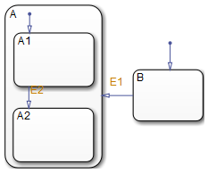
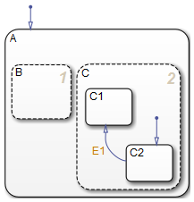

========================
状态
========================
`原文地址 <http://cn.mathworks.com/help/stateflow/ug/states.html>`_

------------------------
什么是状态
------------------------

**状态**\ 描述了一个响应系统工作模式。在Stateflow图中，状态被用来在时序设计中创建状态转移图。

**状态**\ 可以处于有效状态或无效状态。根据事件和条件\ **状态**\ 可以在有效与无效状态间切换。事件的发生使得\ **状态**\ 在有效与无效中切换，从而驱动了状态转移图的执行。执行时的任何时刻，有效的状态和无效的状态共存。

------------------------
状态层次
------------------------
为了管理不同层级的复杂状态，在Stateflow图中使用层次化设计，你可以在一个系统表示多个层级的子系统。

层次化状态举例
------------------------
在下面这个例子中，图中包括三个层次等级。把一个状态画在另一个状态中表示内部的状态是一个外部状态的子状态。外部状态是内部状态的父状态。

在这个例子中，Car_done的上一级是整张Stateflow图。Car_made和Car_shipped的父状态是Car_done。Car_made也是Parts_assembled和Painted的父状态。换句话说，Parts_assembled和Painted是Car_made的子状态。

为了通过文本表示层次化状态，用斜杠(/)来表示当前Stateflow图，用点(.)来分隔层次化状态中的各个层次。下面是用文本表示层次化状态的例子：

* /Car_done
* /Car_done.Car_made
* /Car_done.Car_shipped
* /Car_done.Car_made.Parts_assembled
* /Car_done.Car_made.Painted

状态可以包含的组件
--------------------------
状态可以包含所有其他Stateflow的组件。Stateflow支持层次化方式表示各种图形的包含关系。如果一个状态包括其他状态，那么它是一个\ **超状态**\ 。如果一个状态被另一个状态包含，那么它是一个\ **子状态**\ 。一个状态既不是超状态又不是子状态，那它的上一层就是Stateflow图本身。

状态还可以包含非图像数据和事件。这种层次化的包含关系可以在模型浏览器（Model Explorer）中体现出来。你通过可以指定上一级的数据或事件来定义数据或事件的包含关系。

--------------------------
状态分解（Decomposition）
--------------------------
每一个状态（或者Stateflow图）都有一种\ **分解方法**\ 来规定它可以包含什么类型的子状态。根据超状态分解方法的不同，其所有子状态都必须是一种类型的。状态分解方法包括互斥的(OR)和并行(AND)。

互斥(OR)状态分解
--------------------------
如果一个超状态的子状态的边框是实线，则表示这个超状态是互斥(OR)的。用这种分解方法描述状态互斥的工作模式。一个超状态是互斥时，它所有的子状态同一时刻只有一个有效。

在下面这个例子中，状态A或状态B可以有效。如果状态A有效，那么状态A1或状态A2在给定时刻可以有效。

并行(AND)状态分解
--------------------------
如果一个超状态的子状态的边框是虚线，则表示这个超状态是并行(AND)的。用这种分解方法描述状态并行的工作模式。一个超状态是并行时，它所有的子状态同一时刻都有效。

在下面这个例子中，如果状态A有效，那么状态A1或A2同时有效。

并行的状态之间是完全独立的，请看以下例子。

在下面这个例子中，当状态A有效时，状态B和C同时有效。当状态C有效时，状态C1或状态C2有效。

-------------------------
状态标签(Label)
-------------------------
一个状态的标签位于左上角，格式如下：
::
    
    name/
    entry:entry 行为
    during:during 行为
    exit:exit 行为
    on event_name:on event_name 行为
    bind: 待绑定事件

下面的例子展示了状态标签的使用。

了解更多状态行为，请看：

* `Process for Entering, Executing, and Exiting States <http://cn.mathworks.com/help/stateflow/ug/process-for-entering-executing-and-exiting-states.html>`_ 介绍了entry、during、exit、和on event_name这些状态行为何时以及如何发生。

* `State Action Types <http://cn.mathworks.com/help/stateflow/ug/supported-action-types-for-states-and-transitions.html#f0-128473>`_ 介绍了状态行为的更多细节。

状态名
------------------------------
状态标签以状态名字打头，后缀一个可选的斜杠(/)。在之前的例子中，状态的名字是On和Off。有效的状态名是字母数字下划线的组合。更多内容请点击：
`Rules for Naming Stateflow Objects <http://cn.mathworks.com/help/stateflow/ug/rules-for-naming-stateflow-objects.html>`_ 。

层次化设计为命名状态提供了很大的灵活性。状态标签中的状态名对于上一级状态来说必须是独一无二的。Stateflow中实际的状态名是父状态的名字加上状态标签上的名字(用.分隔)。每一个状态标签上的名字可以相同，只要它们的层次化全名不同即可。否则，解释器会提示错误。

下面的例子展示了状态全名是如何工作的。

.. image:: static/unique_state_names.png

由于位置的不同，每一个状态都有一个独一无二的名字。FAN1和FAN2包含的子状态的全名是：

* PowerOn.FAN1.On
* PowerOn.FAN1.Off
* PowerOn.FAN2.On
* PowerOn.FAN2.Off

状态行为
---------------------------
在状态名之后，可以输入包含关键词的状态行为语句来指定状态行为。你可以设置任意数量的状态行为。每一个关键字后的冒号都是必须的。如果状态名和状态行为语句之间有回车分隔，那么状态名后的斜杠(/)是可选的。

对于每一种类型的状态行为，你可以输入多个相应的行为（通过回车、分号或逗号分隔）。你可以指定多个on event_name语句来相应不同的事件。

如果你在状态名和斜杠(/)后直接输入行为，那么这个被解析为entry行为。这在你只需要指定entry行为时比较方便。

**Entry行为**  以entry或en为前缀。在前面的例子中，状态On包含entry行为on_count=0。这意味着进入状态On时on_count的值被重置为0。

**During行为** 以during或du为前缀。在前面的标签例子中，状态On包含两个during行为，light_on()和on_count++。这些行为在状态On已经有效并且任意事件发生时被执行。

**Exit行为** 以exit或ex为前缀。在前面的标签例子中，状态Off包含exit行为light_off()。当状态Off从有效变为无效时，该行为被执行。

**On Event_Name行为** 以on event_name为前缀，event_name是独一无二的事件名。在前面的标签例子中，状态On包含一个on power_outage行为。如果状态On有效且事件power_outage发生，那么handle_outage()将被执行。

**Bind行为** 以bind为前缀。绑定在状态的事件只能由该状态及其子状态广播。

