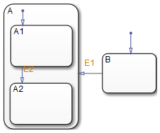
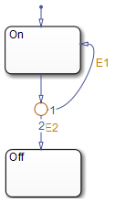
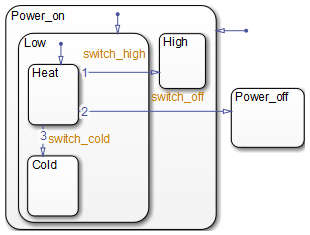
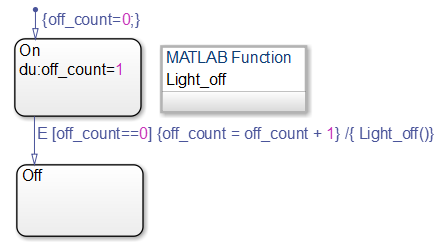

********
状态转移
********

`原文地址 <http://cn.mathworks.com/help/stateflow/ug/transitions.html>`_

状态转移线
==========
状态转移线是一条从一个图形指向另一个图形的带箭头直线。大多数情况下，状态转移线表示了系统从一个状态转移到另一个状态的路径。状态转移线连接出发点和目的地，从出发点开始到目的地结束。下图显示了一个出发点是状态B，目的地是状态A的状态转移线。

转移节点将状态转移线且分为状态转移段。在这种情况下，一个完整的状态转移包括从出发点到目的地的所有状态转移段。在判断整个转移是否有效时，每一段都会被计算。

下面的例子是一个两个包含状态转移段的状态转移：一个从状态On转移到状态Off，另一个从状态On转移回自己。

默认转移线是一种特殊的状态转移线，它没有出发点。点击 `Default Transitions <http://cn.mathworks.com/help/stateflow/ug/default-transitions.html>`_ 了解细节。

层次化转移
==========
状态转移线不能包含其他部件，但是状态可以包含状态转移线。状态转移线的层次由其上级，出发点和目的地描述。上级是能够同时包含出发点和目的地的状态。考虑下面这个例子：

下表解释了各状态转移线。斜杠(/)表示当前Stateflow图。不同层次之间用.分隔。

+-------------+---------------+--------------------+--------------------+
| 转移线标签  | 上级          | 出发点             | 目的地             |
+=============+===============+====================+====================+
| switch_off  | /             | /Power_on.Low.Heat | /Power_off         |
+-------------+---------------+--------------------+--------------------+
| switch_high | /Power_on     | /Power_on.Low.Heat | /Power_on.High     |
+-------------+---------------+--------------------+--------------------+
| switch_cold | /Power_on.Low | /Power_on.Low.Heat | /Power_on.Low.Cold |
+-------------+---------------+--------------------+--------------------+

转移线标签语法
==============

状态转移线的行为由标签来决定。标签可以包含一个事件、一个条件、一个条件行为并且（或）包含一个转移行为。默认转移线的标签是问号(?)。状态转移线标签遵循如下格式：
::

    事件[条件]{条件行为}/转移行为

你可以参考下面这个例子替换上述元素。每一个元素都是可选的。

转移线标签范例
--------------
通过以下范例理解转移线标签中各元素的含义及作用。

**事件** 设置一个触发事件，当该事件发生且条件为真时，转移发生。是否设置触发事件是可选的。如果不设置触发事件则代表该转移在任何事件发生时都被触发。可以使用或运算符（|）设置多个触发事件。

上述例子中，广播事件E的发生将在条件[off_count==0]为真的情况下触发状态On转移到状态Off。

**条件** 设置一个布尔表达式，若该表达式为真，在触发事件发生时转移状态。该表达式需要放置在方括号([])内。点击 `Conditions <http://cn.mathworks.com/help/stateflow/ug/supported-action-types-for-states-and-transitions.html#f0-123753>`_  了解更多关于条件的细节。

上述例子中，条件[off_count==0]为真时，状态跳转才可能执行。

**条件行为** 位于条件之后，需要置于花括号({})之中。只要条件满足，条件行为就会被执行，然后才去计算跳转是否会发生。如果没有设置条件，那么默认条件为真，从而执行条件行为。

上述例子中，如果条件[off_count==0]为真，条件行为off_count++立刻执行。

**转移行为** 当转移已经被计算确定可以执行后，转移行为被执行。如果转移线包含多个转移段，转移行为只有在整个转移线都被计算确定可以执行后才被执行。转移行为需要用一个斜杠(/)与前面其他元素分隔。

上述例子中，如果条件[off_count==0]为真，并且可以转移到目的状态Off，则转移行为LIght_off会被执行。

判断状态转移线是否有效
======================
在大多数情况下，当系统处于出发状态并且可以转移到目的状态，那么状态转移线是有效的。默认状态转移线有些不同，它没有出发状态。当转移到子状态的父状态时才会判断到子状态的默认状态转移是否有效。转移线标签上的各个元素对于默认转移和普通转移同样有效。下表列举了可能转移的情况。

+----------------+--------------------------+
| 状态转移线标签 | 生效条件                 |
+================+==========================+
| 只包含指定事件 | 指定事件发生             |
+----------------+--------------------------+
| 指定事件和条件 | 指定事件发生并且条件满足 |
+----------------+--------------------------+
| 只包含条件     | 任何事件发生并且条件满足 |
+----------------+--------------------------+
| 只包含行为     | 任何事件发生             |
+----------------+--------------------------+
| 未指定         | 任何时间发生             |
+----------------+--------------------------+

